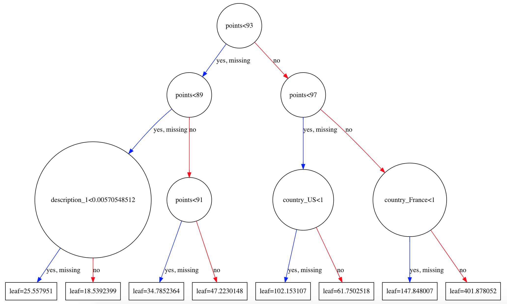

# Wine Price Predictions using  Gradient Boosting Machines

Welcome! The tutorial provides an overview of Gradient Boosting Machines (GBMs) with an example of a wine price model using a Gradient Boosting Trees regression model and real data from Kaggle. The model is trained to predict the price of the wine using both unstructured text data, and structured features such as the region and points. 

## Modeling approach
The data used to train this model is from the [Wine Reviews Dataset](https://www.kaggle.com/zynicide/wine-reviews), a 130k dataset of wine reviews with variety, location, winery, price, and description

The modeling approach is as follows
* Features such as location, and winery are one-hot-encoded into categorical variables using pandas get_dummies function. 
* Text data is cleaned and processed using typical methods to clean text data such as removing punctuation and converting text to lower-case.
* Feature engineering is performed on the wine descriptions using TF-IDF and SVD to compress the body text into 25 latent features.
* A Grandient Boosting Regression Tree model is fit using xgboost. 
* RMSE and MAE is used to evaluate the model.

## Boosting Machines
Boosting Machines are an ensemble of weak learners. By combining multiple weak models, the result is an ensemble model that is quite effective, and does not overfit because all the models are weak.

Gradient Boosting Machines can be used for Regression or Classification tasks. They are typically applied to tree based models, but could in theory be applied to any type of weak learner.

AdaBoosting
AdaBoosting is the simplies effectibe Boosting algorithm for binary classifcation. It seqentially fits weak learners, and ensembles the predictions. As the weak learners are fit, each observation is weighted by it's missclassification weight, causing the next model to foucus on explaining patterns not detected by the previous models.  Predictions are made by majority vote.

Gradient Boosting
refresher on Gradient Descent. Show plots?

Gradient boOsting can be used on both classifcation and regression problems. The weak learners are fit to predict the gradient of the loss function. Any diffentiable loss function used can be selected.Gradient boosting sequentially fits models to the gradient to explain the patterns missed by the previous model. An additive model is used to ensemble the weak learners, as output of the new tree model is added to the output of the previous tree model. It becomes a recursive equation, where each weak learner explains a pattern not picked up by the previous model.
<Show math>

The gradient works out to be the direction of the residuals. insert maths.
<Show math>

Difference between classification and regression loss.
"The generalization allowed arbitrary differentiable loss functions to be used, expanding the technique beyond binary classification problems to support regression, multi-class classification and more."

predictions are made by the resulting additive model. We end up with a big model with lots of terms for each feature, nudging it into different directions?

What is stocastic gradieng Boosting

What is difference between bagging and boosting?

GBMs in Python
sklearn

xgboost
uses regularization

Drink up!

