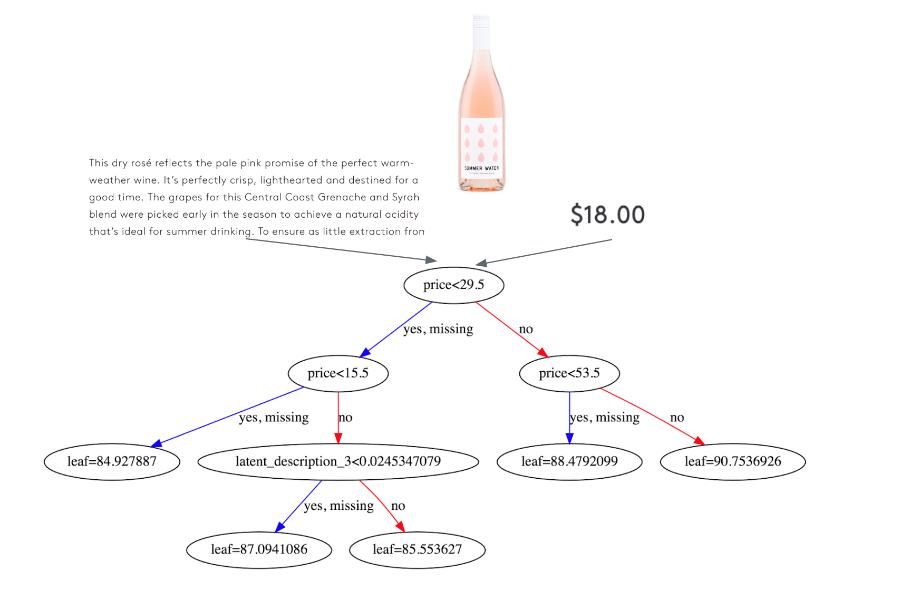

# Wine Quality Predictions using Gradient Boosting Machines

The model uses a Gradient Boosting Trees regression and real data from Kaggle to predict the points of a bottle of wine (y). Points are on a scale of 0-100 and are categorized by Wine Spectator 
* 95-100 Classic: a great wine
* 90-94 Outstanding: a wine of superior character and style
* 85-89 Very good: a wine with special qualities
* 80-84 Good: a solid, well-made wine
* 75-79 Mediocre: a drinkable wine that may have minor flaws
* 50-74 Not recommended

Tutorial on training the GBM model: link coming soon

Tutorial on deploying the model with AWS SageMaker: link coming soon

