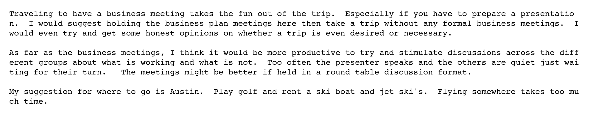
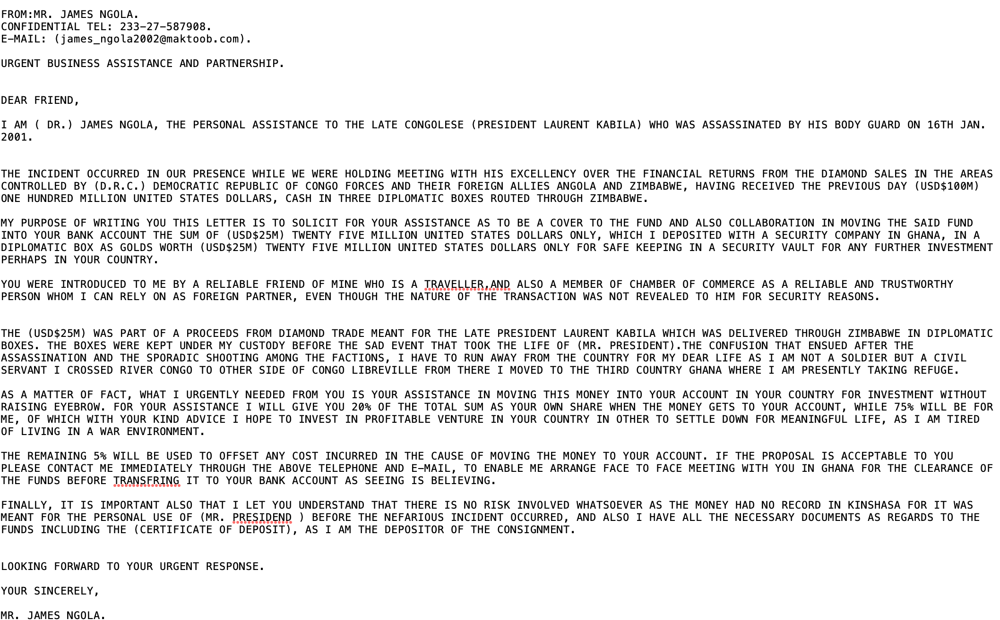

# Spam Email Classification using Gradient Boosting Machines (GBMs)

Welcome! The tutorial provides an overview of Gradient Boosting Machines (GBMs), and shows an example of a spam email detection model using a Gradient Boosting Trees Model and real datasets obtained from Kaggle. The model is trained to predict "Spam" (class 1) versus "Not Spam" (class 0). 

<b>Note:</b> <i>The purpose of this project is simply to apply Gradient Boosting Machines to a real data example. The training data is not optimal for training a true spam detection system, because it is not a representative sample of emails. It was difficult to find example email data that was a representative sample of true emails, and as a result, I would not expect this model to generalize well to the emails in my inbox right now. However, this model could be retrained on a better dataset, and would generalize well. </i>

## Modeling approach
The data used to train this model contains conversational emails from the [Enron Emails Dataset](https://www.kaggle.com/wcukierski/enron-email-dataset). These emails are tagged as "Not Spam". 

Emails from the [Fraudulent Email Corpus](https://www.kaggle.com/rtatman/fraudulent-email-corpus) are tagged as "Spam".

The modeling appraoch is as follows
* Data is cleaned and processed using typical methods to clean text data (see notebook).
* Feature engineering is performed using TF-IDF and SVD to compress email body text into 25 features.
* AGBT model is used to fit the model.
* AUC, Confusion Matrix, and Accuracy are all used to evaluate the model's performance.

## Boosting Machines
Boosting Machines are an ensemble of weak learners. By combining multiple weak models, the result is an ensemble model that is quite effective, and does not overfit because all the models are weak.

Gradient Boosting Machines can be used for Regression or Classification tasks. They are typically applied to tree based models, but could in theory be applied to any type of weak learner.

AdaBoosting
AdaBoosting is the simplies effectibe Boosting algorithm for binary classifcation. It seqentially fits weak learners, and ensembles the predictions. As the weak learners are fit, each observation is weighted by it's missclassification weight, causing the next model to foucus on explaining patterns not detected by the previous models.  Predictions are made by majority vote.

Gradient Boosting
refresher on Gradient Descent. Show plots?

Gradient bossting can be used on both classifcation and regression problems. The weak learners are fit to predict the gradient of the loss function. Any diffentiable loss function used can be selected.Gradient boosting sequentially fits models to the gradient to explain the patterns missed by the previous model. An additive model is used to ensemble the weak learners, as output of the new tree model is added to the output of the previous tree model. It becomes a recursive equation, where each weak learner explains a pattern not picked up by the previous model.
<Show math>

The gradient works out to be the direction of the residuals. insert maths.
<Show math>

Difference between classification and regression loss.
"The generalization allowed arbitrary differentiable loss functions to be used, expanding the technique beyond binary classification problems to support regression, multi-class classification and more."

predictions are made by the resulting additive model. We end up with a big model with lots of terms for each feature, nudging it into different directions?

What is stocastic gradieng Boosting

What is difference between bagging and boosting?

GBMs in Python
sklearn

xgboost
uses regularization
