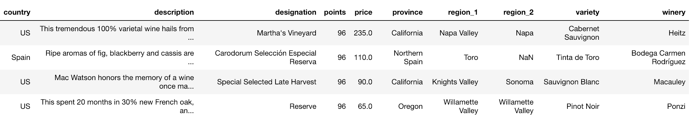
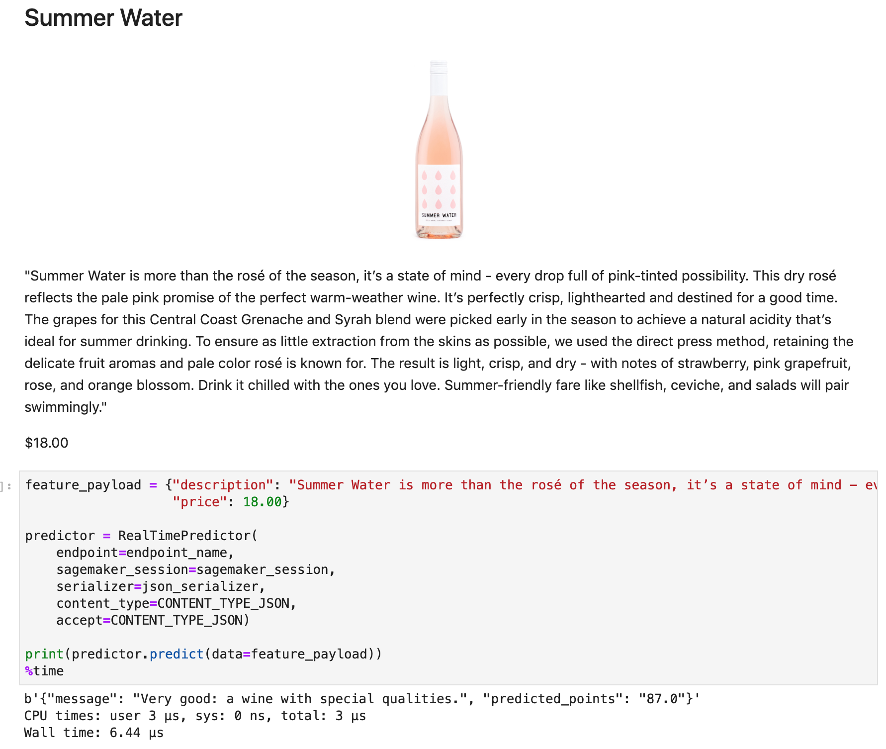
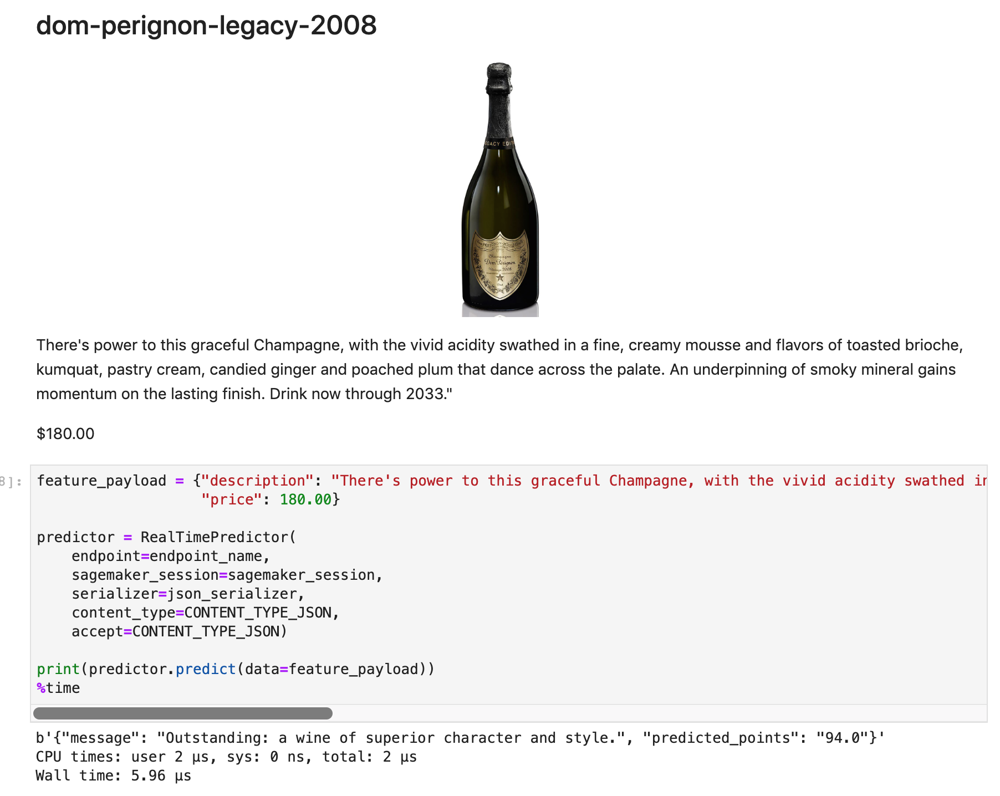

# Wine Quality Predictions using Gradient Boosting Machines

The purpose of this project is to provide an overview of Gradient Boosting Machines (GBMs)s, and demonstrate model training and deployment with AWS SageMaker. 

## Modeling approach
The model uses a Gradient Boosting Trees regression model and real data from Kaggle to predict the points of a bottle of wine (y). Points are on a scale of 0-100 and are categorized by Wine Spectator 
* 95-100 Classic: a great wine
* 90-94 Outstanding: a wine of superior character and style
* 85-89 Very good: a wine with special qualities
* 80-84 Good: a solid, well-made wine
* 75-79 Mediocre: a drinkable wine that may have minor flaws
* 50-74 Not recommended

The features (X) used in this mode are the price of the wine bottle, and latent features obtained from the performing Latent Semantic Analysis (LSA) on the unstructured text data from the descriptions. The data used to train this model can be found here: [Wine Reviews Dataset](https://www.kaggle.com/zynicide/wine-reviews), a 130k dataset of expert wine reviews with variety, location, winery, price, and descriptions.

The modeling approach is as follows
* Text data is cleaned and processed using typical methods to clean document strings, such as removing punctuation and converting text to lower-case.
* Feature engineering is performed on the wine descriptions using LSA (TF-IDF and SVD is used to compress the body text into 25 latent features).
* A Grandient Boosting Regression Tree model is fit using xgboost. 
* RMSE and MAE is used to evaluate the model.

The visualization of one of the weak learner trees in the xgboost model illustrates how the tree splits on the price and latent description. We can see that the price is very influential for predicting the wine quality points! This weak learner also found something meaningful in one of the latent description topics from the LSA. 

## Boosting Machines
Boosting Machines are an ensemble of weak learners. By combining multiple weak models, the result is an ensemble model that is quite effective, and does not overfit because all the models are too weak to overfit. Gradient Boosting Machines can be used for Regression or Classification tasks. They are typically applied to tree based models, but could in theory be applied to any type of weak learner.

coming soon... 

## Model Results

## Training and Deploying with SageMaker

coming soon... 

Drink up!

